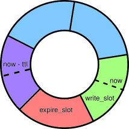

# expiring-atomic-filter

A transparent wrapper for [atomic-cuckoo-filter](https://crates.io/crates/atomic-cuckoo-filter) providing
a time-based expiration mechanism using a circular buffer.

[](https://crates.io/crates/expiring-atomic-filter)
[](https://docs.rs/expiring-atomic-filter)
[](https://github.com/guapodero/expiring-atomic-filter/actions)

## Design
The only design goal of this project is time-based expiration. This requires a marginal amount of added design
complexity, and increases the worst-case performance of most operations by a constant factor.

The filter is divided into a set of "slots". At any given moment, the `write_slot` accepts inserted items, while the
`expire_slot` is either empty or contains only items older than the Time To Live (TTL) that was provided when the
filter was created. This only works if the
[expire](https://docs.rs/expiring-atomic-filter/*/expiring_atomic_filter/struct.ExpiringAtomicFilter.html#method.expire)
method is called periodically with a minimum frequency, which also needs to be defined when the filter is created.

The `ttl` and `expiration_period` determine the number of slots that the filter is divided into.



### Differences from upstream
This library provides the same interface as atomic-cuckoo-filter.
[Documentation](https://docs.rs/atomic-cuckoo-filter/latest/atomic_cuckoo_filter/)

NOTES:

1. Item removal is implemented by checking each filter slot with `contains` before removing the item. Because
`contains` can produce false positives, this can result in hash collisions until the affected slot expires. This
problem is mitigated by increasing the default fingerprint size from 16 to 32. For use cases involving many items
and a short TTL, a smaller fingerprint size might be more appropriate.

2. Capacity is evenly split over the filter slots, based on the assumption that insertions are constant over time.
For bursty workloads, increasing the filter capacity is recommended so that no single filter slot can become full.

## Usage
First please refer to [upstream](https://github.com/farhadi/atomic-cuckoo-filter?tab=readme-ov-file#basic-usage)
for the basics.

```toml
[dependencies.expiring-atomic-filter]
git = "https://github.com/guapodero/expiring-atomic-filter.git"
rev = "d511f9f"
```

```rust
use expiring_atomic_filter::ExpiringAtomicFilter;

static FILTER: LazyLock<ExpiringAtomicFilter> = std::sync::LazyLock::new(|| {
  ExpiringAtomicFilter::builder()
      .ttl(86400) // 1 day is the default
      .expiration_period(3600) // 1 hour is the default
      .build()
      .unwrap()
});

fn main() { 
  // make sure expiration is triggered at least once per hour
  let timer = timer::Timer::new();
  timer.schedule_repeating(chrono::Duration::minutes(30), move || {
    FILTER.expire();
  });

  FILTER.insert("item"); // will expire after 1 day
}
```

## License

This project is licensed under the MIT License - see the [LICENSE](LICENSE) file for details.

## Contribution

See [CONTRIBUTING.md](CONTRIBUTING.md).
